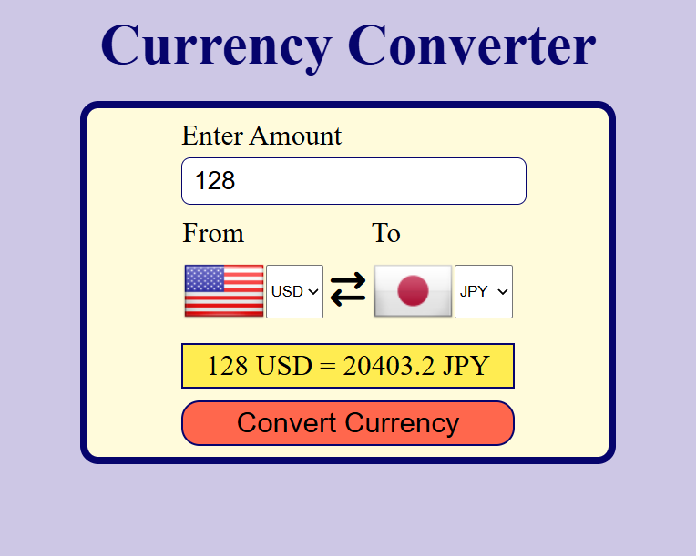

# Currency Converter

A responsive Currency Converter web application built using HTML, CSS, and JavaScript. The application fetches real-time exchange rates and allows users to convert between multiple international currencies with dynamic country flag updates.

## Features

- Real-time currency conversion
- Supports multiple international currencies
- Dynamic country flag updates
- Currency swap functionality
- Input validation for invalid inputs
- Responsive user interface

## Technologies Used

- HTML5
- CSS3
- JavaScript
- Frankfurter Exchange Rate API
- FlagsAPI

## Project Structure

```text
currency-converter/
├── README.md
├── Screenshot.png
├── countryCodes.js
├── index.html
├── script.js
└── style.css
```

## How to Run

1. Clone the repository:

```bash
git clone https://github.com/Mayank171006/currency-converter.git
```

2. Open `index.html` in your browser.

## Screenshot


